# 📝 DevCV & Project Summary Generator

An **AI-powered CV and project summary generator** for development-sector professionals.  
It creates **institution-specific documents** (World Bank, EU, USAID, etc.) in minutes using smart templates.

**Key Features:**
- ⚡ Automated formatting & compliance with donor requirements
- 🖥️ Editable previews before export
- 📄 Export to DOCX or PDF
- ⏱️ Saves hours for consultants, proposal writers, and NGOs

---

## 🗂️ Scheme

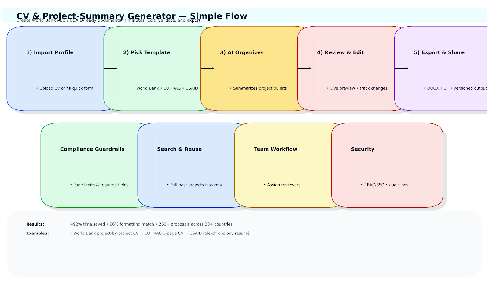

---

## ⚙️ Technical Description
- **Frontend:** React.js + TailwindCSS for live previews & editing
- **Backend:** Node.js + Express
- **AI/NLP Models:** Hugging Face Transformers (T5, DistilBERT), spaCy
- **Storage:** PostgreSQL (structured data) + AWS S3 (file storage)
- **Export Engine:** HTML-to-DOCX / PDF conversion
- **DevOps:** Docker + GitHub Actions + AWS EC2

---

## 🧩 Examples
- 🌍 Generate World Bank-style CVs
- 🇪🇺 Create EU PRAG-compliant project summaries
- 🇺🇸 Auto-format USAID CVs with chronological assignments
- 📝 Edit and preview before exporting

<table>
    <tbody>
        <tr>
            <td>
                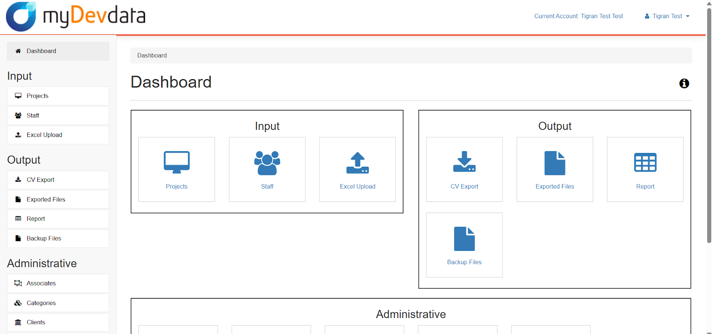
            </td>
            <td>
                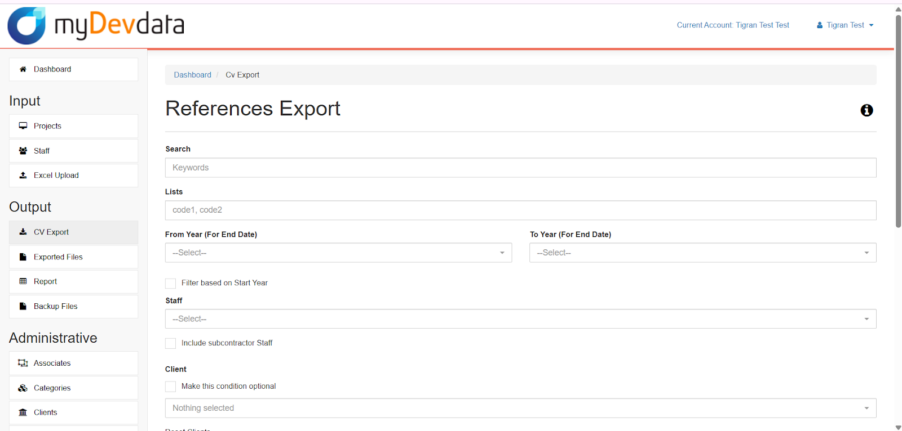
            </td>
        </tr>
        <tr>
            <td>
                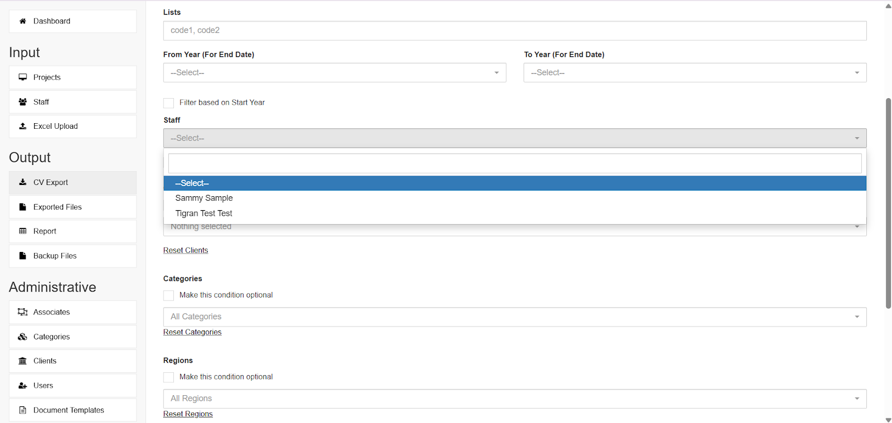
            </td>
            <td>
                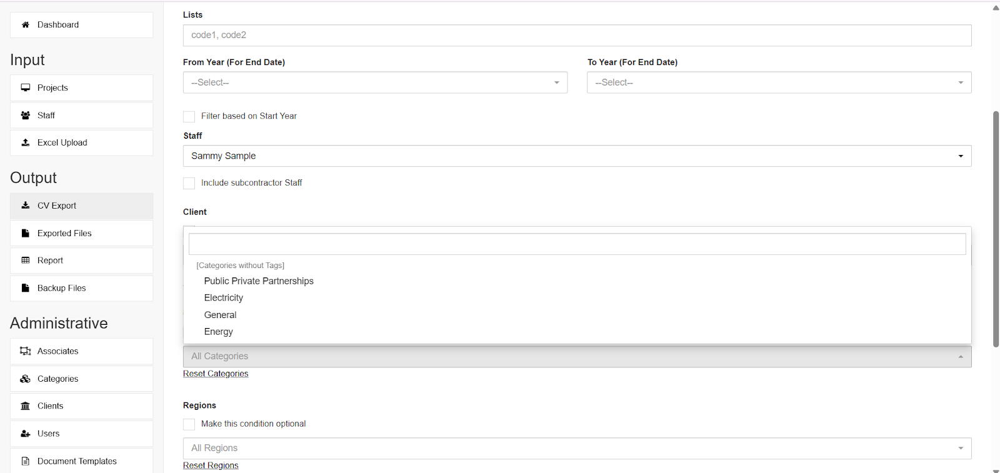
            </td>
        </tr>
        <tr>
            <td>
                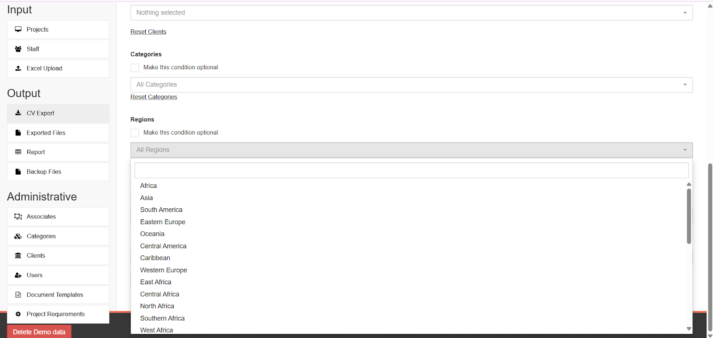
            </td>
            <td>
                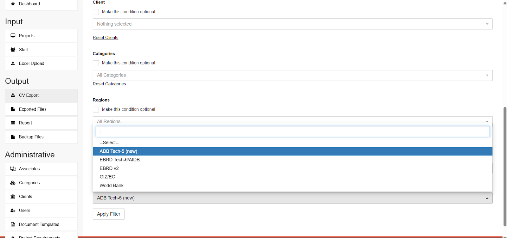
            </td>
        </tr>
        <tr>
            <td>
                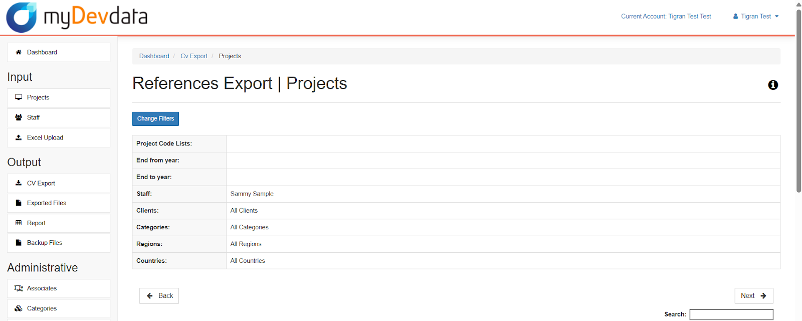
            </td>
            <td>
                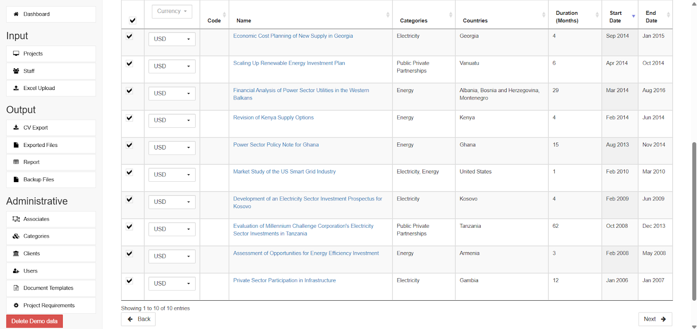
            </td>
        </tr>
        <tr>
            <td>
                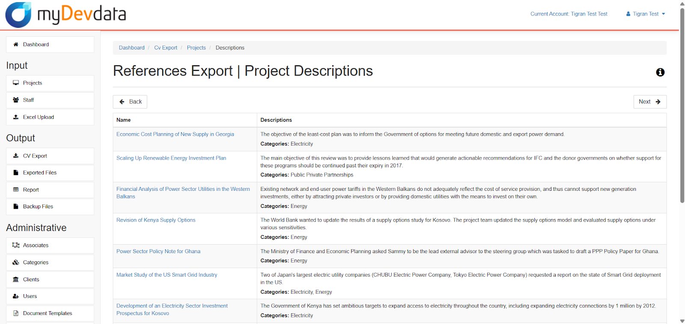
            </td>
            <td>
                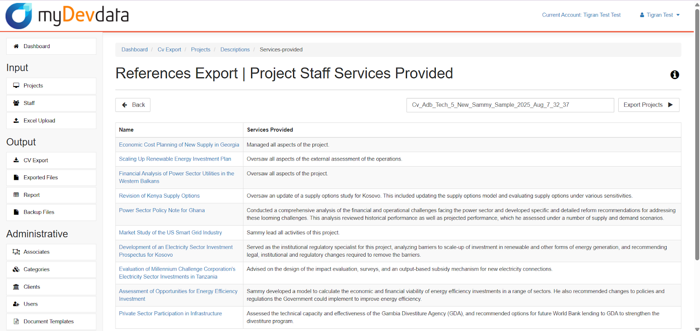
            </td>
        </tr>
        <tr>
            <td>
                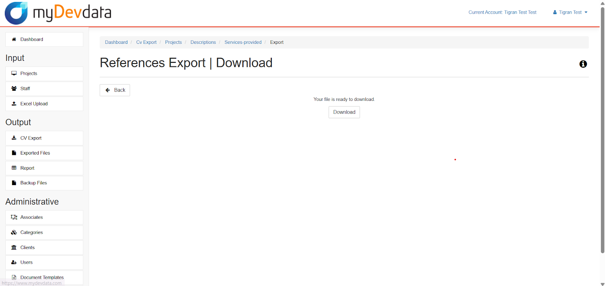
            </td>
            <td></td>
        </tr>
    </tbody>
</table>

---

## 📖 Full Description

### 🔹 Overview
A high-efficiency tool for development professionals to create institution-specific CVs and project summaries in **minutes**, adhering to the formats of organizations like **World Bank, ADB, AfDB, USAID, EU, GIZ**, and more.

### ❌ Problem
- Strict donor-specific formats: World Bank, USAID, EU PRAG
- Manual reformatting is **time-consuming**, **error-prone**, and costly
- Bottlenecks in proposal submissions under **tight deadlines**

### ✅ Solution
- Centralized user profile storing all project & role data
- Smart template selection for each institution
- Auto-generated documents with correct terminology and structure
- Preview & edit before exporting to **DOCX / PDF**
- Saves **4–6 hours per CV** → now **15 minutes**

### 🧠 Training Process Highlights
- **Preprocessing:** Cleaned 1,200+ CVs & project summaries, standardized terminology
- **Model Selection:** DistilBERT + T5 for text summarization & formatting
- **Training & Validation:** Fine-tuned 3 epochs, used data augmentation for robustness
- **Evaluation Metrics:** ROUGE & BLEU, human expert reviews, formatting accuracy ~96%

### 🏆 Achievements
- 92% reduction in formatting time
- Used in **250+ proposals** across **30+ countries**
- Integrated with live preview, DOCX & PDF export, and AI editing assistant

---

## 🛠️ Use Cases
- Independent consultants in international development
- Proposal and grant-writing teams
- NGOs managing framework contracts
- HR teams preparing bids or donor submissions

---

## 📚 References
- Hugging Face Transformers Documentation
- spaCy NLP library
- World Bank, EU, USAID CV & PRAG Guidelines  
